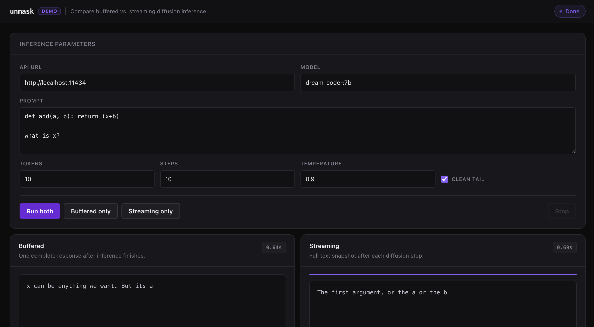

# unmask

`unmask` is a local HTTP server that exposes Ollama and OpenAI-compatible APIs
for diffusion language models. It does not use LM Studio and does not proxy to
any external API. Requests are translated into local diffusion inference against
Dream or LLaDA `.gguf` files.

```text
Continue / Open WebUI / OpenAI-compatible tool
          |
          v
unmask FastAPI server on port 11434
          |
          v
persistent llama-diffusion-server worker
          |
          v
Dream / LLaDA .gguf model file
```

The persistent worker is preferred because it loads the GGUF once and keeps it
in memory. If the worker binary is missing or already running with a different
model, `unmask` can fall back to `llama-diffusion-cli`.

## Prerequisites

- Python 3.10+
- macOS with Metal support for the recommended GPU path
- The included `llama.cpp` checkout built locally

Clone with submodules so the patched `llama.cpp` checkout is available:

```bash
git clone --recurse-submodules https://github.com/Sailaukan/unmask.git
cd unmask
```

If the repository was cloned without submodules, initialize it from the project
root:

```bash
git submodule update --init --recursive
```

The `llama.cpp` submodule tracks:

```text
https://github.com/Sailaukan/llama.cpp.git
branch: unmask-diffusion-optimizations
```

```text
./llama.cpp/build/bin/llama-diffusion-server
./llama.cpp/build/bin/llama-diffusion-cli
```

Build or rebuild the diffusion binaries from the project root:

```bash
cmake -S llama.cpp -B llama.cpp/build -DGGML_METAL=ON
cmake --build llama.cpp/build --target llama-diffusion-server llama-diffusion-cli -j
```

- Model files downloaded under:

```text
~/unmask/models
```

Expected filenames:

```text
~/unmask/models/Dream-org_Dream-v0-Instruct-7B-Q4_K_M.gguf
~/unmask/models/Dream-Coder-v0-Base-7B.i1-Q4_K_S.gguf
~/unmask/models/llada-8b-q4_k_m.gguf
```

`src/unmask/config.py` points to the included `./llama.cpp/build/bin`
binaries by default. Edit it only if you want to use an external `llama.cpp`
checkout or a different model directory.

To update the embedded `llama.cpp` checkout to the latest pushed optimization
branch and rebuild:

```bash
git submodule update --remote llama.cpp
cmake --build llama.cpp/build --target llama-diffusion-server llama-diffusion-cli -j
```

Commit the parent repository after updating the submodule pointer so other
checkouts use the same `llama.cpp` revision.

## Install

```bash
pip install -r requirements.txt
```

To install the package and the `unmask` console command from this checkout:

```bash
pip install -e .
```

## Run

Dream:

```bash
python server.py --model dream:7b
```

LLaDA:

```bash
python server.py --model llada:8b
```

Dream Coder:

```bash
python server.py --model dream-coder:7b
```

The server listens on:

```text
http://localhost:11434
```

If native Ollama is already using port `11434`, stop Ollama first or run
`unmask` on another port:

```bash
python server.py --model dream:7b --port 11435
```

If you installed the package with `pip install -e .`, the same commands can be
run through the console entrypoint:

```bash
unmask --model dream:7b
```

On startup, `unmask` automatically starts:

```text
./llama.cpp/build/bin/llama-diffusion-server
```

The worker listens locally on:

```text
http://127.0.0.1:8088
```

Health check:

```bash
curl http://localhost:8088/health
```

## API

Ollama-compatible:

- `GET /api/tags`
- `POST /api/generate`
- `POST /api/chat`

OpenAI-compatible:

- `GET /v1/models`
- `POST /v1/chat/completions`

Streaming is supported when the persistent worker is available. Diffusion
streaming is step-based: each chunk contains the current full text snapshot
after a denoising step. This is different from autoregressive token streaming,
where each chunk is only the next token.

The included `llama.cpp` checkout has diffusion-specific optimizations:

- Sparse logits: only masked positions needed by the sampler request logits.
- Smaller Metal readback: GPU-to-CPU logits copies scale with active rows instead
  of the full sequence.
- Profiling: direct worker responses include timing fields for decode, logits
  readback, sampling, sorting, and estimated copied logits bytes.

The deeper Metal-side sampler is not implemented yet. Sampling still happens on
CPU, but it now reads far fewer logits rows.

These optimizations are inside the patched `llama.cpp` submodule, while
`unmask` uses them through the persistent worker. The parent repository stores a
pointer to the exact `llama.cpp` commit, not a copy of every upstream
`llama.cpp` file.

By default, `unmask` cleans common diffusion tails such as repeated `2 2 2`,
special stop markers, and repeated role labels. To inspect raw model output,
disable post-processing per request with:

```json
{
  "clean_tail": false
}
```

For Ollama requests, this can also be placed inside `options`.

## Quick Checks

List Ollama-style models:

```bash
curl http://localhost:11434/api/tags
```

Generate:

```bash
curl http://localhost:11434/api/generate \
  -H "Content-Type: application/json" \
  -d '{
    "model": "dream:7b",
    "prompt": "Write one sentence about diffusion language models.",
    "stream": false,
    "options": {
      "num_predict": 128,
      "num_steps": 256,
      "temperature": 0.2
    }
  }'
```

Chat:

```bash
curl http://localhost:11434/api/chat \
  -H "Content-Type: application/json" \
  -d '{
    "model": "dream:7b",
    "messages": [
      {"role": "system", "content": "You are concise."},
      {"role": "user", "content": "Explain diffusion language models in one sentence."}
    ],
    "stream": false
  }'
```

OpenAI-compatible:

```bash
curl http://localhost:11434/v1/chat/completions \
  -H "Content-Type: application/json" \
  -d '{
    "model": "dream:7b",
    "messages": [
      {"role": "user", "content": "Hello"}
    ],
    "max_tokens": 128,
    "temperature": 0.2
  }'
```

Ollama streaming:

```bash
curl -N http://localhost:11434/api/generate \
  -H "Content-Type: application/json" \
  -d '{
    "model": "dream-coder:7b",
    "prompt": "Write a Python function add(a, b).",
    "stream": true,
    "options": {
      "num_predict": 64,
      "num_steps": 128,
      "temperature": 0.2
    }
  }'
```

OpenAI-compatible streaming:

```bash
curl -N http://localhost:11434/v1/chat/completions \
  -H "Content-Type: application/json" \
  -d '{
    "model": "dream-coder:7b",
    "messages": [
      {"role": "user", "content": "Write hello in Python."}
    ],
    "stream": true,
    "max_tokens": 64,
    "diffusion_steps": 128,
    "temperature": 0.2
  }'
```

Direct worker check:

```bash
MODEL_PATH="$HOME/unmask/models/Dream-Coder-v0-Base-7B.i1-Q4_K_S.gguf"
curl http://localhost:8088/generate \
  -H "Content-Type: application/json" \
  -d "{
    \"model_path\": \"$MODEL_PATH\",
    \"prompt\": \"write hello\",
    \"n_tokens\": 16,
    \"steps\": 8,
    \"temperature\": 0.2,
    \"model_flags\": [\"--diffusion-eps\", \"0.001\", \"--diffusion-algorithm\", \"3\"]
  }"
```

The direct worker response includes profiling data:

```json
{
  "timings": {
    "total_ms": 1307.181,
    "decode_ms": 126.499,
    "logits_ms": 1162.975,
    "sampling_ms": 17.688,
    "sort_ms": 0.008,
    "active_logits": 295,
    "requested_logits": 295,
    "skipped_logits": 265,
    "logits_copy_bytes": 179435520
  }
}
```

Direct worker streaming:

```bash
MODEL_PATH="$HOME/unmask/models/Dream-Coder-v0-Base-7B.i1-Q4_K_S.gguf"
curl -N http://localhost:8088/generate/stream \
  -H "Content-Type: application/json" \
  -d "{
    \"model_path\": \"$MODEL_PATH\",
    \"prompt\": \"write hello\",
    \"n_tokens\": 16,
    \"steps\": 8,
    \"temperature\": 0.2,
    \"model_flags\": [\"--diffusion-eps\", \"0.001\", \"--diffusion-algorithm\", \"3\"]
  }"
```

## Continue.dev

Point Continue at the OpenAI-compatible server:

```yaml
models:
  - name: Dream 7B
    provider: openai
    model: dream:7b
    apiBase: http://localhost:11434/v1
    apiKey: local
```

You can also use `dream-coder:7b` for the Dream Coder base model or `llada:8b`
once the LLaDA model file is downloaded.

## Open WebUI

Use the Ollama-compatible connection:

```text
http://localhost:11434
```

The model names exposed by `/api/tags` are:

```text
dream:7b
dream-coder:7b
llada:8b
```

## Browser Demo

A simple local demo page lives in:

```text
demo/index.html
```

Start `unmask` first:

```bash
python server.py --model dream-coder:7b
```

Then open the demo directly in your browser:

```bash
open demo/index.html
```

The page calls `http://localhost:11434/api/generate` and shows buffered output
next to step-streamed diffusion snapshots.



## Project Layout

Runtime Python code lives under `src/unmask`:

```text
llama.cpp/    patched local llama.cpp checkout used by the worker
patches/      historical patch/reference files for llama.cpp changes
demo/         browser demo
src/unmask/
  api/          FastAPI app, protocol routes, request parsing, streaming adapters
  inference/    CLI/worker execution, path validation, output cleanup
  config.py     local paths and default runtime settings
  models.py     model registry and diffusion flags
  cli.py        command-line entrypoint
```

The root `server.py` file is a compatibility launcher for the existing
`python server.py ...` workflow.

## Model Registry

Model-specific diffusion flags live in `src/unmask/models.py`. Dream and LLaDA
flags are kept separate and must not be mixed:

```python
MODELS = {
    "dream:7b": {
        "filename": "Dream-org_Dream-v0-Instruct-7B-Q4_K_M.gguf",
        "flags": ["--diffusion-eps", "0.001", "--diffusion-algorithm", "3"],
    },
    "dream-coder:7b": {
        "filename": "Dream-Coder-v0-Base-7B.i1-Q4_K_S.gguf",
        "flags": ["--diffusion-eps", "0.001", "--diffusion-algorithm", "3"],
    },
    "llada:8b": {
        "filename": "llada-8b-q4_k_m.gguf",
        "flags": ["--diffusion-block-length", "32"],
    },
}
```

## Errors

- Missing `llama-diffusion-server`: printed clearly on startup; `unmask` falls back to `llama-diffusion-cli` when enabled.
- Missing `llama-diffusion-cli`: printed clearly on startup and returned as HTTP `500` if fallback is needed.
- Missing model file: HTTP `404` with the expected full path.
- CLI timeout: HTTP `504`.
- CLI nonzero exit: HTTP `500` with recent stdout/stderr.
- Worker request errors: HTTP `400` or `500` with the worker response body.
- Streaming errors are returned as a final streamed error chunk when headers
  have already been sent.
